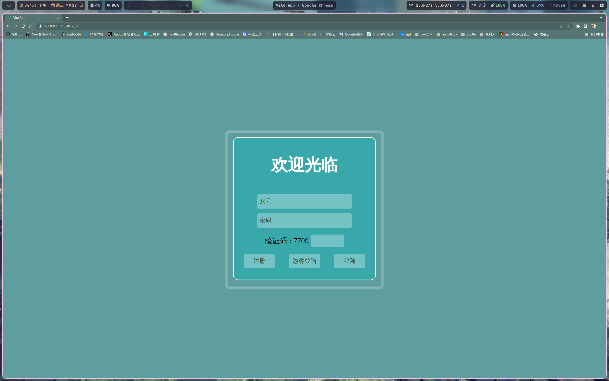
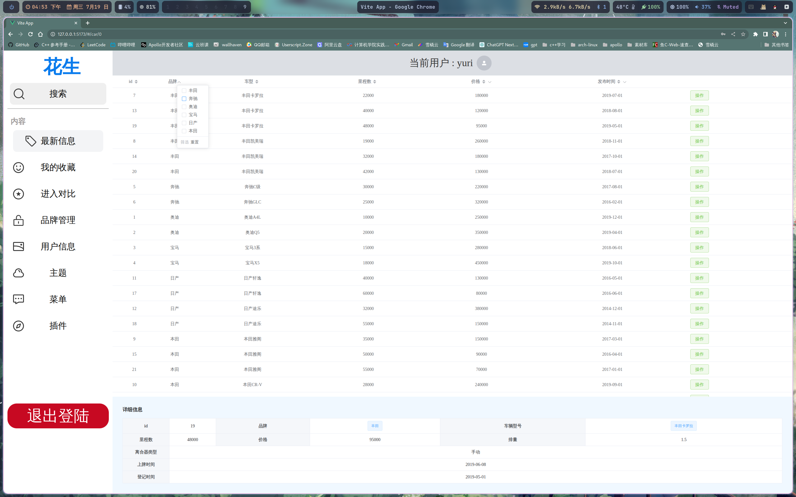
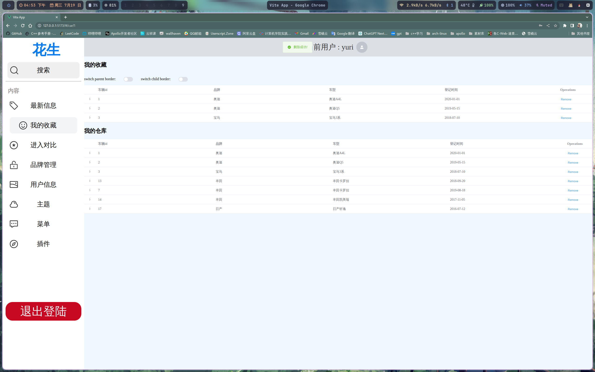
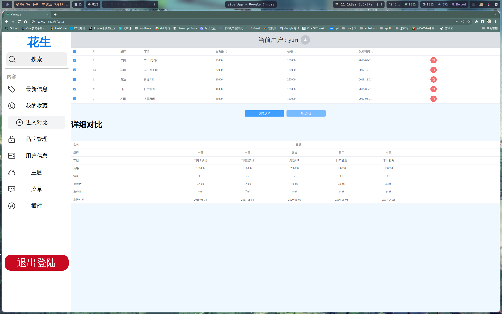
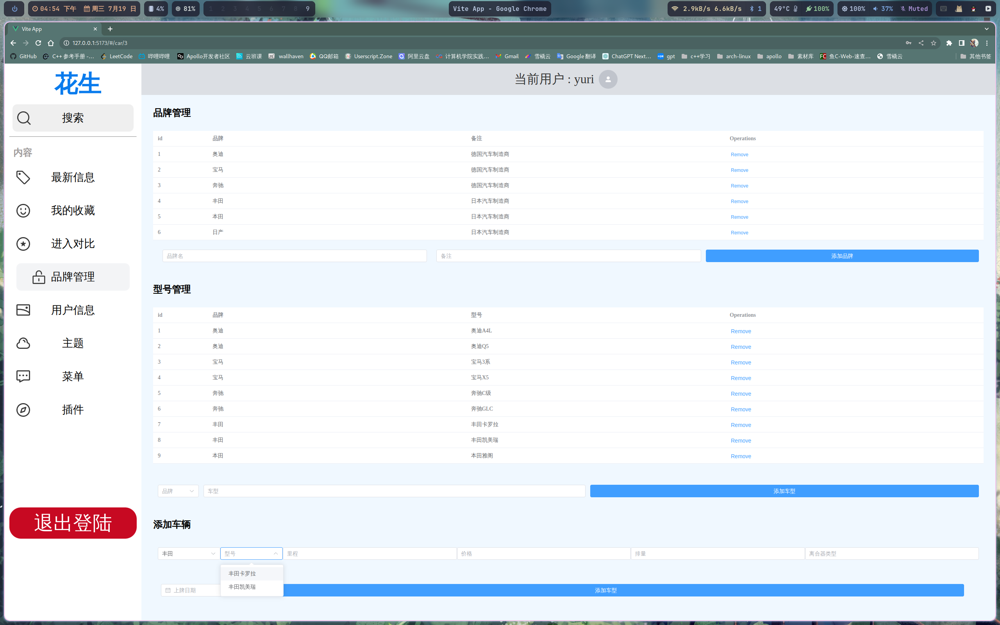
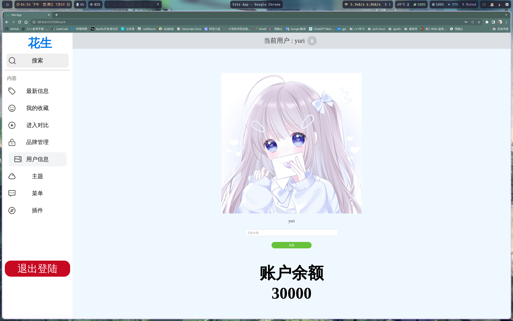

# 二手车管理系统

> 基于sprintboot 和 vue 的二手车管理系统
>
> 练手项目仍任存在bug,等待后续更新
>
> 


## 功能

1. 账号登陆注册/ 游客登陆
2. 二手车信息查看
3. 二手车信息对比功能
4. 二手车收藏/购买功能
5. 后台信息添加/删除
6. 车辆信息添加/删除
7. 。。。。。。。

## 技术栈

前端：

- 主界面： `vue`  版本 : 3.3.4
- 路由导航: `vue-router` 版本 : 4.2.4
- 网络请求: `axios` 版本: 1.4.0
- 组件: `Element-ui plus` 版本 : 2.3.7

后端:

- `Sprint Boot` 版本 : 3.1.1
- `MyBatis` 版本: 3.0.1
- `Mysql` 版本 8.0.33


## 目录结构

```
server : 服务端代码
其余： 前端代码
```


## 测试环境

- `archlinux` 
- `npm` 9.8.0
- `node` 16.20.1
- `jdk` 17


## 启动项目

```bash
git clone https://github.com/yuri2078/second_car.git
cd second_car
#后端 请先执行secode_sql 
java -jar second_car.jar
#前端
npm install 
npm run dev
# 打开浏览器 http://127.0.0.1:5173/ 就能看到效果
```


## 数据库

数据库默认连接地址`localhost:3306/db_car?`

使用本项目需要

1. 本地有`mysql`服务

2. 默认的账户`root` 默认密码`yuri`(如果不是请自行修改)

3. 请执`second_car.sql` 文件建立基础数据服务

4. 想改成自己的地址以及用户名密码请更改文件然后自定打包

   ```java
   server/src/main/resources/application.properties
   ```


## 预览图












